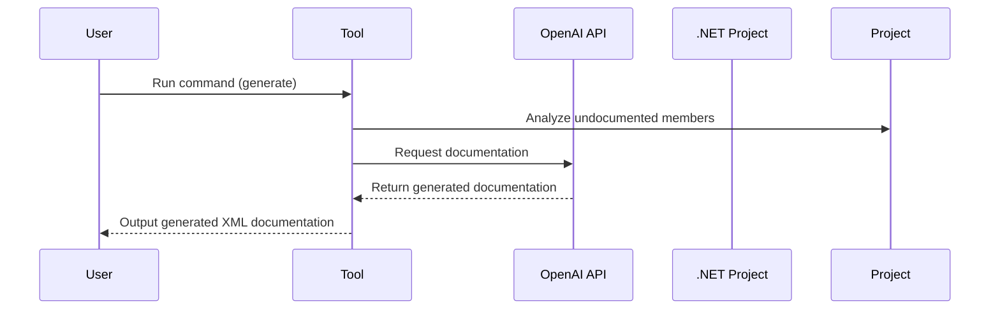

# 

🧠 🤖 AI-powered XML documentation generator for .NET projects. Leveraging OpenAI's API, this tool analyzes your code and generates meaningful, human-readable XML documentation with the help of advanced AI. 

[](https://github.com/guibranco/dotnet-aidocument)
[](https://github.com/guibranco/dotnet-aidocument)
[](https://wakatime.com/badge/github/guibranco/dotnet-aidocument)

[](https://github.com/guibranco/dotnet-aidocument/actions/workflows/build.yml)
[](https://github.com/guibranco/dotnet-aidocument/actions/workflows/ci.yml)
[](https://github.com/guibranco/dotnet-aidocument/actions/workflows/infisical-secrets-check.yml)
[](https://github.com/guibranco/dotnet-aidocument/actions/workflows/linter.yml)

---

> [!CAUTION]
> This project is in beta. It will reach **General Availability (GA)** with the first major release (v1.0).

## What this tool does

`dotnet-aidocument` analyzes your .NET project using [Microsoft.CodeAnalysis.CSharp](https://learn.microsoft.com/en-us/dotnet/csharp/roslyn-sdk/) to identify undocumented members and uses the [OpenAI API](https://platform.openai.com/docs/overview) to generate meaningful XML documentation for them. This tool simplifies and accelerates the process of maintaining high-quality, human-readable documentation.

---

## Requirements

- [OpenAI API key](https://platform.openai.com/api-keys).
- [.NET 8.0 (or higher) runtime](https://dotnet.microsoft.com/en-us/download/dotnet/8.0).

---

## Getting started

[](https://www.nuget.org/packages/AiDocument/)
[](https://www.nuget.org/packages/AiDocument/)

This repository is available on [NuGet](https://www.nuget.org) under the name [AiDocument](https://www.nuget.org/packages/AiDocument/).

### Installation

1. Install the tool globally or for a specific project/repository.

```ps
dotnet tool install -g AiDocument
```

2. Move to the desired project folder.

3. Run the documentation generator.

```ps
dotnet-aidocument generate
```

---

## Sequence of Execution

Here’s a flow diagram showing the sequence of execution of the `prepare-commit-msg` hook and its integration with `dotnet-aicommitmessage` to generate commit messages using the OpenAI API:



---

## Commands

This tool provides several commands to simplify and customize the documentation process:

| Command           | Description                                                                                     |
| ----------------- | ----------------------------------------------------------------------------------------------- |
| `generate`        | Analyzes the project and generates XML documentation for all undocumented members.              |
| `set-settings`    | Sets the OpenAI API key and configuration options.                                              |
| `export-docs`     | Exports the generated XML documentation to a specific folder or location.                       |
| `help`            | Displays information about the available commands.                                              |
| `version`         | Displays the tool's version information.                                                        |

---

## Example workflow

Here’s an example of how to use `dotnet-aidocument`:

1. Analyze the codebase for undocumented members:
   ```ps
   dotnet-aidocument generate
   ```

2. Export the generated XML documentation:
   ```ps
   dotnet-aidocument export-docs -o ./docs/xml
   ```

---

## Debug

To debug and review the OpenAI responses during the documentation generation, use the `-D` flag. This will create a `debug.json` file with the API response data.

### Running in debug mode

```ps
dotnet-aidocument generate -D
```

---

## Example output

Below is an example of the generated XML documentation:

```xml
/// <summary>
/// Calculates the sum of two integers.
/// </summary>
/// <param name="a">The first integer.</param>
/// <param name="b">The second integer.</param>
/// <returns>The sum of the two integers.</returns>
public int Add(int a, int b) { return a + b; }
```

---

## Contributing

Contributions are welcome! Feel free to submit issues, feature requests, or pull requests to help improve `dotnet-aidocument`.

## License

This project is licensed under the [MIT License](https://github.com/guibranco/dotnet-aidocument/blob/main/LICENSE).
